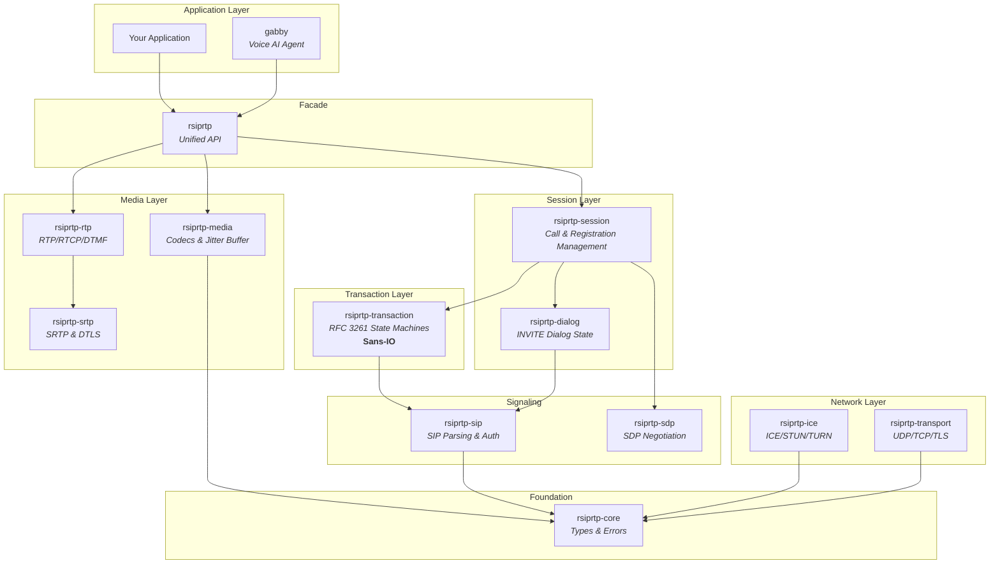
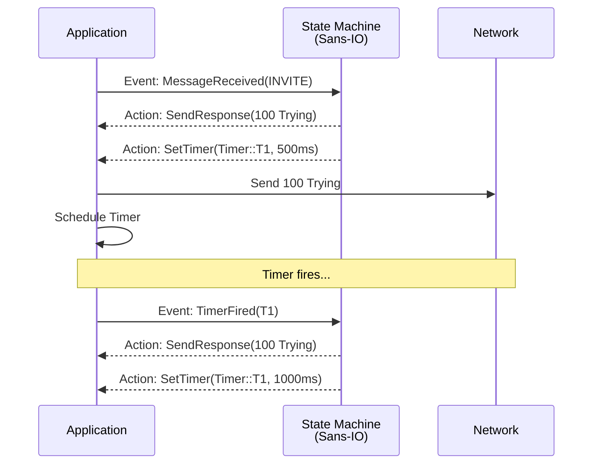
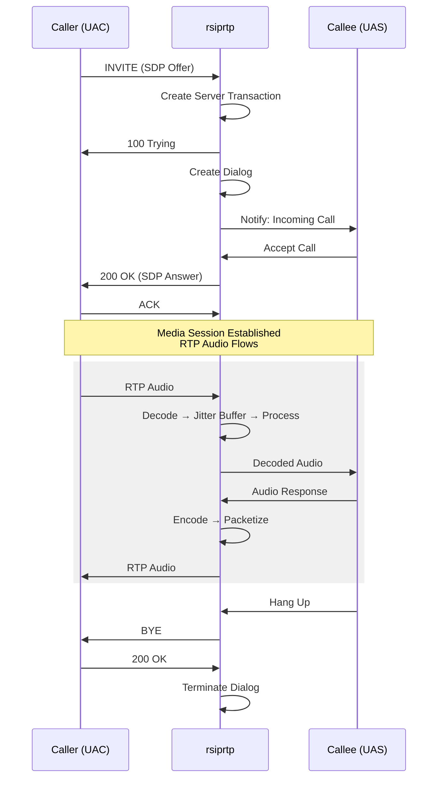
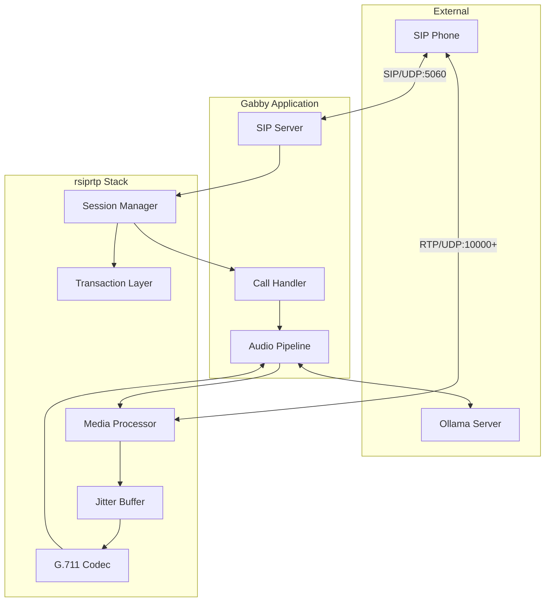

# rsiprtp Architecture

This document is for contributors and curious users who want to understand how
`rsiprtp` is put together. If you just want to use the library, the top-level
[README](README.md) and the [API docs on docs.rs](https://docs.rs/rsiprtp) are
the better starting point.

The stack is organized as a layered Cargo workspace. Lower layers are pure
data and state machines; higher layers add I/O, scheduling, and convenience.
The top-level `rsiprtp` crate is a thin facade that re-exports the public
types every consumer typically needs.

## Crate layering

Responsibilities by crate:

- **`rsiprtp-core`** — shared types, error enum, configuration. No
  dependencies on other workspace crates.
- **`rsiprtp-sip`** — SIP message parsing and building (wraps the `rsip`
  crate), digest authentication helpers, header generators (`Call-ID`, `tag`,
  `branch`).
- **`rsiprtp-transaction`** — RFC 3261 transaction state machines: INVITE
  client, INVITE server, non-INVITE client, non-INVITE server. **Sans-IO**:
  no sockets, no timers, no async runtime — just `Event` in, `Action` out.
- **`rsiprtp-dialog`** — INVITE dialog state, `DialogId`, route-set tracking.
- **`rsiprtp-sdp`** — SDP grammar (RFC 4566), offer/answer negotiation
  (RFC 3264), an SDP builder for outbound offers/answers.
- **`rsiprtp-transport`** — UDP, TCP, and TLS transports on top of Tokio,
  plus DNS resolution.
- **`rsiprtp-rtp`** — RTP packet encoding/decoding, RTCP sender and receiver
  reports, RFC 4733 DTMF events, an `RtpSession` that owns sequence and
  timestamp state.
- **`rsiprtp-srtp`** — SRTP encryption/decryption and DTLS-SRTP key exchange.
- **`rsiprtp-ice`** — ICE, STUN, and TURN. Standalone crates today; not yet
  fully integrated into the high-level call flow.
- **`rsiprtp-media`** — audio codecs (G.711, G.722, Opus), an adaptive
  jitter buffer, and helpers for resampling/mixing.
- **`rsiprtp-session`** — high-level `CallManager` and `RegistrationManager`
  that compose the layers below into something usable.
- **`rsiprtp`** — facade crate, re-exports the rest. This is the only crate
  most consumers depend on directly.

## The Sans-IO pattern

The transaction and dialog layers do not perform I/O. They are deterministic
state machines: feed them events, get back actions. The caller is responsible
for executing those actions (sending bytes on a socket, scheduling a timer,
delivering messages to higher layers).

Why this matters:

- **Determinism.** A given input sequence produces the same output sequence
  every time. Bug reproductions are trivial: replay the event log.
- **Testability.** Unit tests don't need sockets, timers, or async. They feed
  events, assert on actions, and run in microseconds.
- **Runtime independence.** The state machines compile and run anywhere. The
  `rsiprtp-session` layer happens to use Tokio, but that's a choice made
  above the Sans-IO core, not baked in.
- **Composability.** The same transaction crate can drive a UDP UA, a TCP
  proxy, or an in-memory simulator.

## SIP call establishment

A typical UA-to-UA INVITE flow as orchestrated by `CallManager`:

## Companion: gabby

[`crates/gabby`](crates/gabby) is a Voice AI agent that uses `rsiprtp` as its
SIP/RTP stack. It is not part of the published library — it depends on native
libraries (Vosk) that don't fit a `cargo install` workflow — but it is a
useful end-to-end demonstration of how the pieces fit together.

### Voice pipeline

```mermaid
flowchart LR
    subgraph Input["Incoming Audio"]
        SIP_IN[SIP/RTP]
        DECODE[G.711 Decode]
        RESAMPLE_UP[8kHz → 16kHz]
    end

    subgraph Processing["AI Processing"]
        VAD[Voice Activity<br/>Detection]
        STT[Vosk STT]
        LLM[Ollama LLM]
        TTS[Piper TTS]
    end

    subgraph Output["Outgoing Audio"]
        RESAMPLE_DOWN[22kHz → 8kHz]
        ENCODE[G.711 Encode]
        SIP_OUT[SIP/RTP]
    end

    SIP_IN --> DECODE --> RESAMPLE_UP --> VAD
    VAD --> STT
    STT -->|transcript| LLM
    LLM -->|response| TTS
    TTS --> RESAMPLE_DOWN --> ENCODE --> SIP_OUT

    style VAD fill:#f9f,stroke:#333
    style STT fill:#bbf,stroke:#333
    style LLM fill:#bfb,stroke:#333
    style TTS fill:#fbb,stroke:#333
```

### Component interactions during a call

The voice pipeline lives entirely in `gabby`. From `rsiprtp`'s point of view,
gabby is just another consumer: it asks the session layer for incoming RTP
frames, hands back outgoing RTP frames, and handles signaling events.

## Network ports (gabby defaults)

| Port          | Protocol | Purpose            |
|---------------|----------|--------------------|
| 5060          | UDP/TCP  | SIP signaling      |
| 10000-20000   | UDP      | RTP media streams  |

These are gabby's defaults. The `rsiprtp` library itself does not bind any
ports until you configure a `ManagerConfig` and start a transport.

## Further reading

- [README.md](README.md) — public-facing overview and quick start
- [CONTRIBUTING.md](CONTRIBUTING.md) — development workflow
- [docs.rs/rsiprtp](https://docs.rs/rsiprtp) — generated API documentation
- `crates/<name>/src/lib.rs` — each crate has a module-level doc comment
  describing its scope and types
